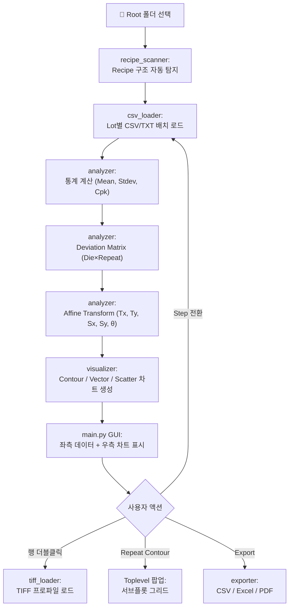
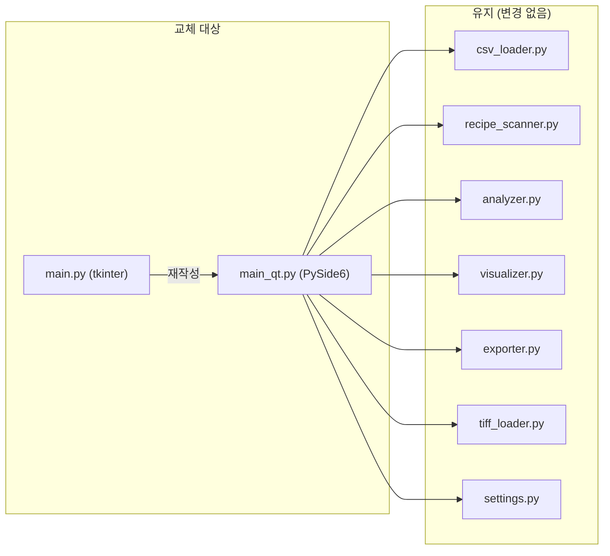

# 📊 XY Stage Positioning Offset Analysis Tool

> **프로젝트**: PSPylib TIFF 기반 XY Stage Offset 분석 도구  
> **버전**: v8.0 (Phase 8d)  
> **최종 업데이트**: 2026-02-24  
> **플랫폼**: Windows / Python 3.11+  

---

## 1. 프로젝트 개요

반도체/MEMS 장비의 XY Stage가 웨이퍼 상의 각 Die 위치로 이동할 때 발생하는 **위치 오프셋(Offset)**을 체계적으로 분석하는 데스크톱 도구입니다.

### 핵심 가치
- **다단계 Recipe 비교**: Vision Pattern Matching, In-Die Align, LLC Translation, Global Align 등 여러 보정 단계를 한 번에 로드하여 비교
- **계통 오차 분리**: Affine Transform을 통해 Stage H/W의 Translation, Scaling, Rotation 오차를 수학적으로 추출
- **Die 단위 시각화**: Wafer Contour Map, Vector Map, XY Scatter 등으로 공간적 패턴을 즉시 파악
- **TIFF 프로파일 연동**: PSPylib 포맷의 TIFF 측정 데이터를 직접 로드하여 표면 프로파일 확인

---

## 2. 기술 스택

### 언어 및 런타임
| 항목 | 기술 |
|---|---|
| **언어** | Python 3.11 |
| **GUI 프레임워크** | tkinter / ttk (표준 라이브러리) |
| **차트 엔진** | Matplotlib 3.x (`TkAgg` 백엔드) |
| **데이터 처리** | pandas, numpy |
| **보간 알고리즘** | scipy.interpolate (`griddata`, cubic) |
| **선형대수** | numpy.linalg (`lstsq` — Affine Transform) |
| **TIFF 파싱** | struct 모듈 (커스텀 PSPylib 바이너리 파서) |
| **설정 관리** | JSON (`settings.json`) |
| **리포트 출력** | openpyxl (Excel), matplotlib PDF |

### 외부 의존성 (pip)
```
numpy
pandas
scipy
matplotlib
openpyxl
```

---

## 3. 프로젝트 구조

```
98. Python_tiff/
├── src/
│   ├── main.py              # GUI 메인 애플리케이션 (DataAnalyzerApp)
│   ├── csv_loader.py        # Lot 폴더 스캔, CSV/TXT 배치 로드
│   ├── recipe_scanner.py    # Recipe 디렉토리 구조 자동 탐지
│   ├── analyzer.py          # 통계, Cpk, Deviation Matrix, Affine Transform
│   ├── visualizer.py        # Matplotlib 차트 생성 (Contour, Vector, Scatter 등)
│   ├── exporter.py          # CSV/Excel 내보내기
│   ├── pdf_generator.py     # PDF 리포트 생성
│   ├── tiff_loader.py       # PSPylib TIFF 바이너리 파서
│   ├── settings.py          # 설정 로드/저장 유틸리티
│   └── settings.json        # 사용자 설정 (Spec, 창 위치 등)
└── PROJECT_SUMMARY.md       # 이 문서
```

---

## 4. 모듈 상세

### 4.1 `csv_loader.py` — 데이터 로딩
- Lot 폴더 단위로 CSV/TXT 파일을 스캔
- `HZ1_O` 컬럼에서 X/Y Offset 값 추출
- Outlier 감지 (IQR 방식) 및 유효성 필터링
- 배치 로드 시 Round(1st/2nd) 및 Axis(X/Y) 필터 지원

### 4.2 `recipe_scanner.py` — Recipe 자동 탐지
- 지정 폴더 하위의 Recipe 디렉토리 구조를 자동으로 스캔
- Step 인덱스, 이름, Round 경로를 구조화하여 반환
- `load_all_recipes` — 전체 Recipe를 한 번에 로드

### 4.3 `analyzer.py` — 분석 엔진
| 함수 | 설명 |
|---|---|
| `compute_statistics` | N, Mean, StdDev, Min, Max, CV% |
| `compute_cpk` | Cpk = min((USL-μ), (μ-LSL)) / (3σ) |
| `compute_deviation_matrix` | Die × Repeat 편차 행렬 생성 |
| `compute_xy_product` | X평균 × Y평균 교차 분석 |
| `compute_affine_transform` | **최소자승법**으로 Tx, Ty, Sx(ppm), Sy(ppm), θ(deg) 추출 |
| `compute_repeatability` | 반복성(Repeatability) 통계 |
| `detect_outliers` | IQR 기반 이상치 검출 |

#### Affine Transform 수학 모델
```
dx = Tx + Sx·x − θ·y
dy = Ty + Sy·y + θ·x

→ numpy.linalg.lstsq로 [Tx, Sx, θ] 및 [Ty, Sy, θ] 를 역산
```

### 4.4 `visualizer.py` — 시각화
| 함수 | 차트 유형 |
|---|---|
| `plot_wafer_contour` | 원형 Wafer Contour Map (Die 좌표 기반 cubic 보간) |
| `plot_vector_map` | Quiver Plot — Die별 오차 크기/방향을 화살표로 표현 |
| `plot_xy_scatter` | Die별 X/Y 편차 산점도 |
| `plot_die_position_map` | 21개 Die 위치 레퍼런스 맵 |
| `plot_trend_chart` | Lot 단위 트렌드 |
| `plot_boxplot` | 분포 Box Plot |

### 4.5 `tiff_loader.py` — PSPylib TIFF 파서
- Park Systems의 PSPylib 포맷 TIFF를 바이너리 레벨에서 파싱
- 2D 높이 데이터, 채널 정보, 스캔 크기 등 메타데이터 추출
- matplotlib 프로파일 차트로 시각화

### 4.6 `main.py` — GUI (DataAnalyzerApp)
**레이아웃 구조:**
```
┌─────────────────────────────────────────────────────────────┐
│ [📁 폴더] [찾아보기] [🔄 스캔 & 분석]      [Excel] [CSV] [PDF] │
├─────────────────────────────────────────────────────────────┤
│ Workflow: [Step 1 ▶ Step 2 ▶ Step 3 ▶ Step 4]              │
├──────────────────────┬──────────────────────────────────────┤
│ X Offset    Y Offset │                                      │
│ (Stats Cards)        │   Contour X | Contour Y | X*Y |     │
│ ✅ PASS  ❌ FAIL     │   XY Scatter | Vector Map |         │
│──────────────────────│   Die Position | 트렌드 | 분포 | TIFF │
│ [📝 시스템 로그]       │                                      │
│ [🗄️ 데이터 테이블]     │      (전체 높이 차트 영역)            │
│  ├ Summary           │                                      │
│  ├ Die별 평균 (히트맵) │                                      │
│  ├ Raw Deviation     │                                      │
│  └ 원본 데이터        │                                      │
└──────────────────────┴──────────────────────────────────────┘
│ 상태바                                                       │
└─────────────────────────────────────────────────────────────┘
```

**주요 UI 기능:**
- **둥근 탭 디자인** (Rounded.TNotebook)
- **히트맵 데이터 테이블** (Die Average: 양방향 Red-Blue / StdDev·Range: Steel Blue 단방향)
- **Luminance 기반 텍스트 색상 자동 반전** (가독성 보장)
- **드래그 선택 & Ctrl+C 복사** (`winfo_containing` 방식)
- **Repeat별 Contour Map 팝업** (별도 창, PNG 다운로드)
- **시스템 로그** (시간대별 컬러 로그, Affine Transform 결과 자동 출력)

---

## 5. 데이터 처리 워크플로우



---

## 6. 개발 히스토리 (Phase 요약)

| Phase | 내용 | 상태 |
|---|---|---|
| 1 | 데이터 로딩 모듈 (`csv_loader`, `tiff_loader`) | ✅ |
| 2-3 | 분석 엔진 + 시각화 (`analyzer`, `visualizer`, `exporter`) | ✅ |
| 4 | GUI 초기 구현 (tkinter) | ✅ |
| 5 | 통합 테스트 및 폴리싱 | ✅ |
| 6 | Multi-Recipe Dashboard | ✅ |
| 7 | Guided Workflow UI + Cpk/Spec + Plugin 기능 이식 | ✅ |
| 7b | 탭 복원, TIFF 버그 수정, Deviation Matrix, XY Scatter | ✅ |
| 8 | **레이아웃 전면 개편** + System Log + Vector Map + Affine Transform | ✅ |
| 8b | Text Contrast 개선 + Die Average 히트맵 (A안: 풀 컬러) | ✅ |
| 8c | 드래그 선택·복사 + Steel Blue 그라데이션 + Repeat Contour 팝업 | ✅ |
| 8d | 드래그 선택 버그 수정 (winfo_containing) + 빨간 테두리 + Contour 선명도 | ✅ |

---

## 7. PySide6 마이그레이션 계획

### 7.1 왜 PySide6인가?

| 항목 | tkinter (현재) | PySide6 (목표) |
|---|---|---|
| **렌더링 품질** | OS 기본 위젯, 플랫한 디자인 | OpenGL 가속, 안티앨리어싱, 고해상도 DPI 지원 |
| **데이터 그리드** | Treeview or 커스텀 Label Grid | `QTableView` + `QStandardItemModel` — 셀 단위 색상, 선택, 복사 네이티브 지원 |
| **스타일링** | ttk 테마 제약, 커스텀 한계 | **QSS (Qt Style Sheets)** — CSS와 유사한 자유도 |
| **차트 통합** | FigureCanvasTkAgg (Matplotlib) | `FigureCanvasQTAgg` (동일 Matplotlib) 또는 **QtCharts** |
| **반응성** | 단일 스레드 + threading | `QThread` + Signal/Slot 패턴으로 안전한 비동기 처리 |
| **다국어/폰트** | 제한적 | 완벽한 유니코드 + 커스텀 폰트 로딩 |
| **테마** | 수동 구현 | `QPalette` 또는 QSS로 다크/라이트 테마 전환 용이 |
| **라이선스** | PSF | LGPL v3 (상업 사용 가능) |

### 7.2 마이그레이션 전략: **점진적 모듈 교체**

> [!IMPORTANT]
> 백엔드(analyzer, csv_loader, visualizer 등)는 **그대로 유지**합니다.
> GUI 레이어(`main.py`)만 PySide6로 재작성합니다.



### 7.3 단계별 마이그레이션 로드맵

#### Phase M1: 환경 설정 및 기본 창 (1일)
- [ ] `pip install PySide6` 종속성 추가
- [ ] `main_qt.py` 생성 — `QMainWindow` 기본 골격
- [ ] 다크 테마 QSS 스타일시트 작성 (Catppuccin Mocha 색상 유지)
- [ ] `QSplitter`로 좌·우 패널 레이아웃 구성
- [ ] 상단 툴바 (폴더 선택, 스캔, Export 버튼)

#### Phase M2: 좌측 패널 — Stats + Data Tables (2일)
- [ ] X/Y Offset 통계 카드 — `QGroupBox` + `QLabel`
- [ ] `QTabWidget`으로 시스템 로그 / 데이터 테이블 탭 구현
- [ ] 시스템 로그 → `QTextEdit` (읽기 전용, HTML 컬러 로그)
- [ ] **Die 평균 테이블** → `QTableView` + 커스텀 `QStyledItemDelegate`
  - 셀 배경색 히트맵 렌더링 (네이티브 `paint()` 오버라이드)
  - 드래그 선택 + Ctrl+C 복사 **네이티브 지원** (별도 코드 불필요)
- [ ] **Raw Deviation 행렬** → `QTableView` + 히트맵 Delegate
- [ ] Summary / 원본 데이터 탭

#### Phase M3: 우측 패널 — 차트 통합 (1일)
- [ ] `QTabWidget`으로 차트 탭 배치
- [ ] `FigureCanvasQTAgg`로 Matplotlib 차트 임베딩 (기존 visualizer.py 함수 그대로 사용)
- [ ] `NavigationToolbar2QT` 연동
- [ ] Repeat Contour 팝업 → `QDialog`

#### Phase M4: Step Navigation 워크플로우 (1일)
- [ ] 상단 네비게이션 바 — `QPushButton` 체인 with `QButtonGroup`
- [ ] Step 클릭 시 비동기 데이터 로드 (`QThread` + `pyqtSignal`)
- [ ] 진행 상태 표시 (`QProgressBar`)

#### Phase M5: TIFF 연동 + Export (0.5일)
- [ ] 원본 데이터 더블클릭 → TIFF 프로파일 차트
- [ ] CSV / Excel / PDF Export 연동 (기존 모듈 호출)

#### Phase M6: 폴리싱 및 고급 기능 (1일)
- [ ] 고해상도 DPI Scaling 확인
- [ ] 라이트/다크 테마 전환 토글
- [ ] Spec 설정 다이얼로그 (`QDialog` + `QDoubleSpinBox`)
- [ ] 창 상태 저장/복원 (`QSettings`)

### 7.4 예상 파일 구조 (마이그레이션 후)

```
src/
├── main_qt.py           # [NEW] PySide6 메인 윈도우
├── widgets/             # [NEW] 커스텀 Qt 위젯
│   ├── heatmap_table.py #   QTableView + HeatmapDelegate
│   ├── stat_card.py     #   X/Y Stat Card 위젯
│   ├── log_viewer.py    #   시스템 로그 QTextEdit
│   └── chart_tab.py     #   Matplotlib Canvas 탭
├── styles/              # [NEW] QSS 스타일시트
│   ├── dark.qss         #   다크 테마
│   └── light.qss        #   라이트 테마
├── analyzer.py          # [유지] 분석 엔진
├── csv_loader.py        # [유지] 데이터 로딩
├── recipe_scanner.py    # [유지] Recipe 스캔
├── visualizer.py        # [유지] Matplotlib 차트
├── exporter.py          # [유지] CSV/Excel 내보내기
├── pdf_generator.py     # [유지] PDF 리포트
├── tiff_loader.py       # [유지] TIFF 파서
├── settings.py          # [유지] 설정 관리
└── settings.json        # [유지] 사용자 설정
```

### 7.5 핵심 이점: QTableView 히트맵

```python
# QStyledItemDelegate를 사용한 히트맵 셀 렌더링 예시
class HeatmapDelegate(QStyledItemDelegate):
    def paint(self, painter, option, index):
        value = index.data(Qt.DisplayRole)
        ratio = value / self.max_val  # 정규화
        
        # 배경색 계산
        bg = self._diverging_color(ratio)
        painter.fillRect(option.rect, bg)
        
        # 텍스트 (대비 자동 계산)
        fg = Qt.black if bg.lightnessF() > 0.5 else Qt.white
        painter.setPen(fg)
        painter.drawText(option.rect, Qt.AlignRight | Qt.AlignVCenter, 
                        f"{value:.3f}")
```

> **기존 tkinter에서 100줄 이상 걸리던 히트맵 Grid + 드래그 선택 + 복사 로직이,
> PySide6에서는 약 30줄의 Delegate 코드로 완벽하게 동작합니다.**

### 7.6 마이그레이션 시 주의사항

> [!WARNING]
> - tkinter 버전(`main.py`)과 PySide6 버전(`main_qt.py`)을 **병행 유지**하여 안정화 기간 동안 폴백 가능하도록 합니다.
> - `visualizer.py`의 Matplotlib 백엔드를 `TkAgg` → `QtAgg`로 전환해야 합니다 (`matplotlib.use('QtAgg')`).
> - PySide6는 별도 설치가 필요하므로 배포 환경에서 `pip install PySide6` 또는 **PyInstaller** 패키징을 고려해야 합니다.

### 7.7 예상 일정

| 단계 | 소요 기간 | 누적 |
|---|---|---|
| M1: 기본 창 + 레이아웃 | 1일 | 1일 |
| M2: 데이터 테이블 + Stats | 2일 | 3일 |
| M3: 차트 통합 | 1일 | 4일 |
| M4: Workflow Nav + 비동기 | 1일 | 5일 |
| M5: TIFF + Export | 0.5일 | 5.5일 |
| M6: 폴리싱 + 테마 | 1일 | **6.5일** |

---

## 8. 실행 방법

```bash
cd "c:\Users\Spare\Desktop\03. Program\98. Python_tiff\src"
python main.py
```

### 의존성 설치
```bash
pip install numpy pandas scipy matplotlib openpyxl
```

### PySide6 버전 (마이그레이션 후)
```bash
pip install PySide6
python main_qt.py
```

---

## 9. 설정 파일 (`settings.json`)

```json
{
  "spec_limits": {
    "Vision Pattern Rec...": { "X": {"lsl": -5000, "usl": 5000}, "Y": {...} },
    "In-Die Align":          { "X": {"lsl": -5000, "usl": 5000}, "Y": {...} }
  },
  "spec_deviation": {
    "default":               { "spec_range": 4.0, "spec_stddev": 0.8 },
    "Global Align":          { "spec_range": 7.5, "spec_stddev": 2.2 }
  }
}
```

- **`spec_limits`**: Cpk 계산용 LSL/USL (nm 단위)
- **`spec_deviation`**: Deviation Matrix의 Range/StdDev 판정 기준 (µm 단위)

---

*이 문서는 프로젝트의 현재 상태와 향후 마이그레이션 방향을 정리한 것입니다.*
